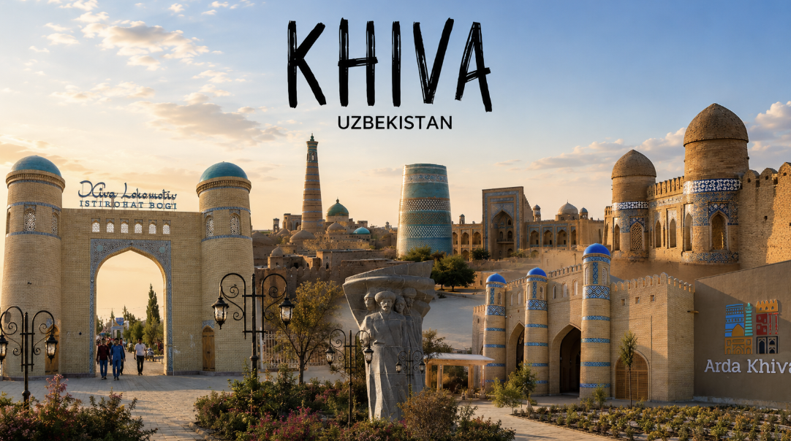
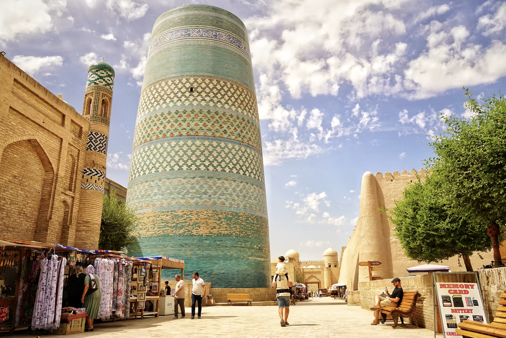

# 🗺️ Khiva Website — The Ultimate Silk Road Guide

Welcome to the ultimate digital tour of **Khiva, Uzbekistan**! This project is an immersive tourism web application designed to bring the magic of an ancient desert oasis into a clean, responsive modern web experience. 

Khiva is a historic city filled with stunning geometric tiles, towering minarets, and centuries of Silk Road history. This website serves as the perfect interactive gateway for modern travelers.

🌍 **Live Demo:** [khiva-website.vercel.app](https://khiva-website.vercel.app)

---

## ✨ Features & Architecture

This project is built using pure **HTML5, CSS3, and JavaScript**, maximizing performance with zero bloat. It features a multi-page architecture designed for seamless navigation:

* **🏠 Home (`index.html`):** A cinematic landing page featuring a dynamic hero section (`khiva-hero.png`) that immediately introduces travelers to the city's historic silhouette.
* **🏰 Itchan Kala (`itchan-kala.html`):** A dedicated deep-dive into the legendary walled inner city, exploring ancient architectural monuments.
* **🐪 Plan Your Trip (`visit.html`):** An interactive planning portal containing curated travel insights, historical timelines (`history.png`), and localized activity suggestions.

---

## 🚀 Key Technical Highlights

* **Pure Vanilla Stack:** Leverages 100% native Web APIs for lightweight, lightning-fast rendering.
* **Modular Styling:** Fully customized layout transitions structured natively in `styles.css`.
* **Dynamic Elements:** Client-side interactivity driven entirely by lightweight logic in `script.js`.
* **Optimized CDN Hosting:** Deployed flawlessly on Vercel's edge network for global availability.

---

## 📸 Sneak Peek & Media

| Historic Vistas | Travel Planning |
|---|---|
|  |  |

---

🛠️ Made and developed with heart by **Sulaymon** (`ssulaymon18`).
Feel free to contact: email [sultanov.sulaymon18@gmail.com] or slack [ssulaymon18]
